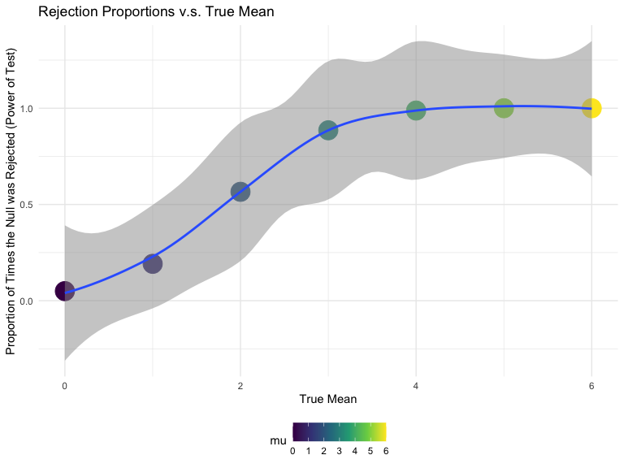
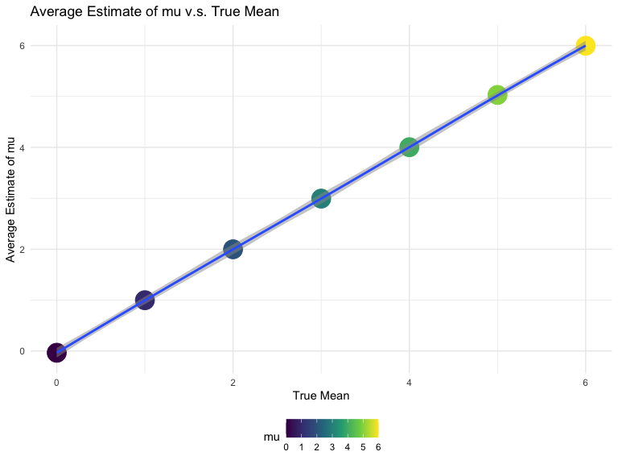
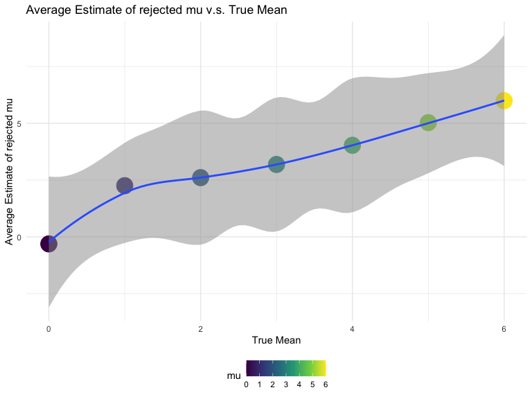
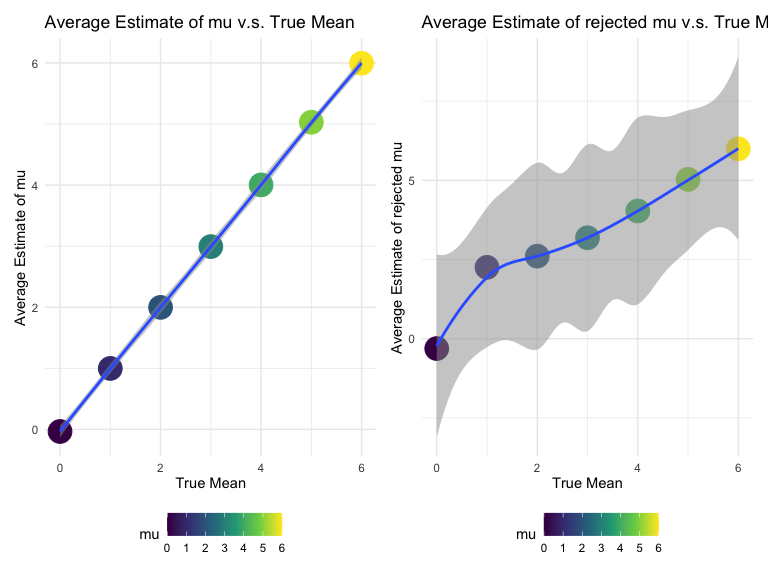

p8105_hw5_yy3297
================
Yunxi Yang
2022-11-15

#### Problem 1

The code chunk below imports the data in individual spreadsheets
contained in `./data/zip_data/`. To do this, I create a dataframe that
includes the list of all files in that directory and the complete path
to each file. As a next step, I `map` over paths and import data using
the `read_csv` function. Finally, I `unnest` the result of `map`.

``` r
full_df = 
  tibble(
    files = list.files("data/zip_data/"),
    path = str_c("data/zip_data/", files)
  ) %>% 
  mutate(data = map(path, read_csv)) %>% 
  unnest()
```

    ## Rows: 1 Columns: 8
    ## ── Column specification ────────────────────────────────────────────────────────
    ## Delimiter: ","
    ## dbl (8): week_1, week_2, week_3, week_4, week_5, week_6, week_7, week_8
    ## 
    ## ℹ Use `spec()` to retrieve the full column specification for this data.
    ## ℹ Specify the column types or set `show_col_types = FALSE` to quiet this message.
    ## Rows: 1 Columns: 8
    ## ── Column specification ────────────────────────────────────────────────────────
    ## Delimiter: ","
    ## dbl (8): week_1, week_2, week_3, week_4, week_5, week_6, week_7, week_8
    ## 
    ## ℹ Use `spec()` to retrieve the full column specification for this data.
    ## ℹ Specify the column types or set `show_col_types = FALSE` to quiet this message.
    ## Rows: 1 Columns: 8
    ## ── Column specification ────────────────────────────────────────────────────────
    ## Delimiter: ","
    ## dbl (8): week_1, week_2, week_3, week_4, week_5, week_6, week_7, week_8
    ## 
    ## ℹ Use `spec()` to retrieve the full column specification for this data.
    ## ℹ Specify the column types or set `show_col_types = FALSE` to quiet this message.
    ## Rows: 1 Columns: 8
    ## ── Column specification ────────────────────────────────────────────────────────
    ## Delimiter: ","
    ## dbl (8): week_1, week_2, week_3, week_4, week_5, week_6, week_7, week_8
    ## 
    ## ℹ Use `spec()` to retrieve the full column specification for this data.
    ## ℹ Specify the column types or set `show_col_types = FALSE` to quiet this message.
    ## Rows: 1 Columns: 8
    ## ── Column specification ────────────────────────────────────────────────────────
    ## Delimiter: ","
    ## dbl (8): week_1, week_2, week_3, week_4, week_5, week_6, week_7, week_8
    ## 
    ## ℹ Use `spec()` to retrieve the full column specification for this data.
    ## ℹ Specify the column types or set `show_col_types = FALSE` to quiet this message.
    ## Rows: 1 Columns: 8
    ## ── Column specification ────────────────────────────────────────────────────────
    ## Delimiter: ","
    ## dbl (8): week_1, week_2, week_3, week_4, week_5, week_6, week_7, week_8
    ## 
    ## ℹ Use `spec()` to retrieve the full column specification for this data.
    ## ℹ Specify the column types or set `show_col_types = FALSE` to quiet this message.
    ## Rows: 1 Columns: 8
    ## ── Column specification ────────────────────────────────────────────────────────
    ## Delimiter: ","
    ## dbl (8): week_1, week_2, week_3, week_4, week_5, week_6, week_7, week_8
    ## 
    ## ℹ Use `spec()` to retrieve the full column specification for this data.
    ## ℹ Specify the column types or set `show_col_types = FALSE` to quiet this message.
    ## Rows: 1 Columns: 8
    ## ── Column specification ────────────────────────────────────────────────────────
    ## Delimiter: ","
    ## dbl (8): week_1, week_2, week_3, week_4, week_5, week_6, week_7, week_8
    ## 
    ## ℹ Use `spec()` to retrieve the full column specification for this data.
    ## ℹ Specify the column types or set `show_col_types = FALSE` to quiet this message.
    ## Rows: 1 Columns: 8
    ## ── Column specification ────────────────────────────────────────────────────────
    ## Delimiter: ","
    ## dbl (8): week_1, week_2, week_3, week_4, week_5, week_6, week_7, week_8
    ## 
    ## ℹ Use `spec()` to retrieve the full column specification for this data.
    ## ℹ Specify the column types or set `show_col_types = FALSE` to quiet this message.
    ## Rows: 1 Columns: 8
    ## ── Column specification ────────────────────────────────────────────────────────
    ## Delimiter: ","
    ## dbl (8): week_1, week_2, week_3, week_4, week_5, week_6, week_7, week_8
    ## 
    ## ℹ Use `spec()` to retrieve the full column specification for this data.
    ## ℹ Specify the column types or set `show_col_types = FALSE` to quiet this message.
    ## Rows: 1 Columns: 8
    ## ── Column specification ────────────────────────────────────────────────────────
    ## Delimiter: ","
    ## dbl (8): week_1, week_2, week_3, week_4, week_5, week_6, week_7, week_8
    ## 
    ## ℹ Use `spec()` to retrieve the full column specification for this data.
    ## ℹ Specify the column types or set `show_col_types = FALSE` to quiet this message.
    ## Rows: 1 Columns: 8
    ## ── Column specification ────────────────────────────────────────────────────────
    ## Delimiter: ","
    ## dbl (8): week_1, week_2, week_3, week_4, week_5, week_6, week_7, week_8
    ## 
    ## ℹ Use `spec()` to retrieve the full column specification for this data.
    ## ℹ Specify the column types or set `show_col_types = FALSE` to quiet this message.
    ## Rows: 1 Columns: 8
    ## ── Column specification ────────────────────────────────────────────────────────
    ## Delimiter: ","
    ## dbl (8): week_1, week_2, week_3, week_4, week_5, week_6, week_7, week_8
    ## 
    ## ℹ Use `spec()` to retrieve the full column specification for this data.
    ## ℹ Specify the column types or set `show_col_types = FALSE` to quiet this message.
    ## Rows: 1 Columns: 8
    ## ── Column specification ────────────────────────────────────────────────────────
    ## Delimiter: ","
    ## dbl (8): week_1, week_2, week_3, week_4, week_5, week_6, week_7, week_8
    ## 
    ## ℹ Use `spec()` to retrieve the full column specification for this data.
    ## ℹ Specify the column types or set `show_col_types = FALSE` to quiet this message.
    ## Rows: 1 Columns: 8
    ## ── Column specification ────────────────────────────────────────────────────────
    ## Delimiter: ","
    ## dbl (8): week_1, week_2, week_3, week_4, week_5, week_6, week_7, week_8
    ## 
    ## ℹ Use `spec()` to retrieve the full column specification for this data.
    ## ℹ Specify the column types or set `show_col_types = FALSE` to quiet this message.
    ## Rows: 1 Columns: 8
    ## ── Column specification ────────────────────────────────────────────────────────
    ## Delimiter: ","
    ## dbl (8): week_1, week_2, week_3, week_4, week_5, week_6, week_7, week_8
    ## 
    ## ℹ Use `spec()` to retrieve the full column specification for this data.
    ## ℹ Specify the column types or set `show_col_types = FALSE` to quiet this message.
    ## Rows: 1 Columns: 8
    ## ── Column specification ────────────────────────────────────────────────────────
    ## Delimiter: ","
    ## dbl (8): week_1, week_2, week_3, week_4, week_5, week_6, week_7, week_8
    ## 
    ## ℹ Use `spec()` to retrieve the full column specification for this data.
    ## ℹ Specify the column types or set `show_col_types = FALSE` to quiet this message.
    ## Rows: 1 Columns: 8
    ## ── Column specification ────────────────────────────────────────────────────────
    ## Delimiter: ","
    ## dbl (8): week_1, week_2, week_3, week_4, week_5, week_6, week_7, week_8
    ## 
    ## ℹ Use `spec()` to retrieve the full column specification for this data.
    ## ℹ Specify the column types or set `show_col_types = FALSE` to quiet this message.
    ## Rows: 1 Columns: 8
    ## ── Column specification ────────────────────────────────────────────────────────
    ## Delimiter: ","
    ## dbl (8): week_1, week_2, week_3, week_4, week_5, week_6, week_7, week_8
    ## 
    ## ℹ Use `spec()` to retrieve the full column specification for this data.
    ## ℹ Specify the column types or set `show_col_types = FALSE` to quiet this message.
    ## Rows: 1 Columns: 8
    ## ── Column specification ────────────────────────────────────────────────────────
    ## Delimiter: ","
    ## dbl (8): week_1, week_2, week_3, week_4, week_5, week_6, week_7, week_8
    ## 
    ## ℹ Use `spec()` to retrieve the full column specification for this data.
    ## ℹ Specify the column types or set `show_col_types = FALSE` to quiet this message.

The result of the previous code chunk isn’t tidy – data are wide rather
than long, and some important variables are included as parts of others.
The code chunk below tides the data using string manipulations on the
file, converting from wide to long, and selecting relevant variables.

``` r
tidy_df = 
  full_df %>% 
  mutate(
    files = str_replace(files, ".csv", ""),
    group = str_sub(files, 1, 3)) %>% 
  pivot_longer(
    week_1:week_8,
    names_to = "week",
    values_to = "outcome",
    names_prefix = "week_") %>% 
  mutate(week = as.numeric(week)) %>% 
  select(group, subj = files, week, outcome)
tidy_df
```

    ## # A tibble: 160 × 4
    ##    group subj    week outcome
    ##    <chr> <chr>  <dbl>   <dbl>
    ##  1 con   con_01     1    0.2 
    ##  2 con   con_01     2   -1.31
    ##  3 con   con_01     3    0.66
    ##  4 con   con_01     4    1.96
    ##  5 con   con_01     5    0.23
    ##  6 con   con_01     6    1.09
    ##  7 con   con_01     7    0.05
    ##  8 con   con_01     8    1.94
    ##  9 con   con_02     1    1.13
    ## 10 con   con_02     2   -0.88
    ## # … with 150 more rows

Finally, the code chunk below creates a plot showing individual data,
faceted by group.

``` r
tidy_df %>% 
  ggplot(aes(x = week, y = outcome, group = subj, color = group)) + 
  geom_point() + 
  geom_path() + 
  facet_grid(~group)
```


This plot suggests high within-subject correlation – subjects who start
above average end up above average, and those that start below average
end up below average. Subjects in the control group generally don’t
change over time, but those in the experiment group increase their
outcome in a roughly linear way.

#### Problem 2

- Import data set of homicide-data.csv; Convert the blanks and “unknown”
  to na for standardization purpose without modifying the raw data
  values of data set.

``` r
homicide_df <- read.csv(file = "data/homicide-data.csv", na = c(" ", "Unknown"))
```

- Description about the raw data:

This data set included the location of the killing, whether an arrest
was made and, in most cases, basic demographic information about each
victim. The 50 police departments were selected based on the size of the
city and their violent crime reported to the FBI in 2012.

Specifically speaking, this data set contains 52179 rows and 12 columns,
with each row representing the information collected for each victim.
There are 52179 observations and 14 variables. Variables include uid,
reported_date, victim_last, victim_first, victim_race, victim_age,
victim_sex, city, state, lat, lon, disposition. The ‘uid’ variable is
the id number of each victim. The ‘reported_date’ is the case reporting
date as recorded. The ‘victim_last’ variable suggests the last name of
victim. The ‘victim_first’ variable suggests the first name of victim.
The ‘victim_race’ is a categorical variable suggesting the race of each
victim. The ‘victim_age’ suggests each victim’s age. The ‘city’,‘state’
suggests the city and state where the crime cases happened. The ‘lat’
and ‘lon’ suggests the specific location with latitude and longitude
where the crime cases happened. The ‘disposition’ suggests that the
disposition status for each victim’s case.

- Create a new city_state variable (e.g. “Baltimore, MD”); I have also
  noticed that the age variable category is not appropriate, so I adjust
  it into a numerical variable here; I have also noticed that there is a
  mismatching data row between the city and state, “Tulsa” and “AL”. As
  I am not sure which should be the correct recording, I decided to
  delete this row to clear any confusion for further calculation; I
  categorize the cases of losed without arrest or Open/No arrest into
  unsolved cases, and categorize else into solved cases.

``` r
homicide_df = 
  homicide_df %>% 
  janitor::clean_names() %>%
  mutate(
    city_state = str_c(city, state, sep = ", ", collapse = NULL),
    victim_age = as.numeric(victim_age),
    case_unsolved = ifelse(disposition == "Closed without arrest" | disposition == "Open/No arrest", 1, 0)
  ) %>%
  relocate(city_state) %>%
  filter(city_state != "Tulsa, AL")
```

- Then summarize within cities to obtain the total number of homicides
  and the number of unsolved homicides (those for which the disposition
  is “Closed without arrest” or “Open/No arrest”).

``` r
count_homicide_df =
  homicide_df %>%
  group_by(city_state) %>%
  summarize(
    n_total_homicides = n(),
    n_unsolved_homicides = sum(case_unsolved)
  ) 
count_homicide_df %>%
  knitr::kable()
```

| city_state         | n_total_homicides | n_unsolved_homicides |
|:-------------------|------------------:|---------------------:|
| Albuquerque, NM    |               378 |                  146 |
| Atlanta, GA        |               973 |                  373 |
| Baltimore, MD      |              2827 |                 1825 |
| Baton Rouge, LA    |               424 |                  196 |
| Birmingham, AL     |               800 |                  347 |
| Boston, MA         |               614 |                  310 |
| Buffalo, NY        |               521 |                  319 |
| Charlotte, NC      |               687 |                  206 |
| Chicago, IL        |              5535 |                 4073 |
| Cincinnati, OH     |               694 |                  309 |
| Columbus, OH       |              1084 |                  575 |
| Dallas, TX         |              1567 |                  754 |
| Denver, CO         |               312 |                  169 |
| Detroit, MI        |              2519 |                 1482 |
| Durham, NC         |               276 |                  101 |
| Fort Worth, TX     |               549 |                  255 |
| Fresno, CA         |               487 |                  169 |
| Houston, TX        |              2942 |                 1493 |
| Indianapolis, IN   |              1322 |                  594 |
| Jacksonville, FL   |              1168 |                  597 |
| Kansas City, MO    |              1190 |                  486 |
| Las Vegas, NV      |              1381 |                  572 |
| Long Beach, CA     |               378 |                  156 |
| Los Angeles, CA    |              2257 |                 1106 |
| Louisville, KY     |               576 |                  261 |
| Memphis, TN        |              1514 |                  483 |
| Miami, FL          |               744 |                  450 |
| Milwaukee, wI      |              1115 |                  403 |
| Minneapolis, MN    |               366 |                  187 |
| Nashville, TN      |               767 |                  278 |
| New Orleans, LA    |              1434 |                  930 |
| New York, NY       |               627 |                  243 |
| Oakland, CA        |               947 |                  508 |
| Oklahoma City, OK  |               672 |                  326 |
| Omaha, NE          |               409 |                  169 |
| Philadelphia, PA   |              3037 |                 1360 |
| Phoenix, AZ        |               914 |                  504 |
| Pittsburgh, PA     |               631 |                  337 |
| Richmond, VA       |               429 |                  113 |
| Sacramento, CA     |               376 |                  139 |
| San Antonio, TX    |               833 |                  357 |
| San Bernardino, CA |               275 |                  170 |
| San Diego, CA      |               461 |                  175 |
| San Francisco, CA  |               663 |                  336 |
| Savannah, GA       |               246 |                  115 |
| St. Louis, MO      |              1677 |                  905 |
| Stockton, CA       |               444 |                  266 |
| Tampa, FL          |               208 |                   95 |
| Tulsa, OK          |               583 |                  193 |
| Washington, DC     |              1345 |                  589 |

- For the city of Baltimore, MD, use the prop.test function to estimate
  the proportion of homicides that are unsolved; save the output of
  prop.test as an R object, apply the broom::tidy to this object and
  pull the estimated proportion and confidence intervals from the
  resulting tidy data frame.

``` r
baltimore_homicide_df = 
  count_homicide_df %>%
  filter(city_state == "Baltimore, MD")
baltimore_homicide_df
```

    ## # A tibble: 1 × 3
    ##   city_state    n_total_homicides n_unsolved_homicides
    ##   <chr>                     <int>                <dbl>
    ## 1 Baltimore, MD              2827                 1825

``` r
baltimore_prop_test = 
  prop.test(
    x = baltimore_homicide_df %>% pull(n_unsolved_homicides),
    n = baltimore_homicide_df %>% pull(n_total_homicides)
  )

baltimore_prop_test %>% 
  broom::tidy() %>% 
  knitr::kable()
```

|  estimate | statistic | p.value | parameter |  conf.low | conf.high | method                                               | alternative |
|----------:|----------:|--------:|----------:|----------:|----------:|:-----------------------------------------------------|:------------|
| 0.6455607 |   239.011 |       0 |         1 | 0.6275625 | 0.6631599 | 1-sample proportions test with continuity correction | two.sided   |

Now run prop.test for each of the cities in your dataset, and extract
both the proportion of unsolved homicides and the confidence interval
for each.

Do this within a “tidy” pipeline, making use of purrr::map, purrr::map2,
list columns and unnest as necessary to create a tidy data frame with
estimated proportions and CIs for each city.

Create a prop test function for general application to all cities’
calculations.

``` r
prop_test_function = function(count_homicide_df){
  
  city_prop_test = 
    prop.test(
      x = count_homicide_df %>% pull(n_unsolved_homicides),
      n = count_homicide_df %>% pull(n_total_homicides)
    )
  
  return(city_prop_test)
}

# prop_test_function(baltimore_homicide_df)
# check passed, the value calculated by function is aligned with the direct calculation using prop.test
```

Iterate across all cities

``` r
all_results_df = 
  count_homicide_df %>% 
    nest(data = 2:3) %>% 
    mutate(
      test_results = map(data, prop_test_function),
      tidy_results = map(test_results, broom::tidy)
    ) %>% 
    select(city_state, tidy_results) %>% 
    unnest(tidy_results) %>% 
    select(city_state, estimate, starts_with('conf'))
all_results_df %>% 
  knitr::kable()
```

| city_state         |  estimate |  conf.low | conf.high |
|:-------------------|----------:|----------:|----------:|
| Albuquerque, NM    | 0.3862434 | 0.3372604 | 0.4375766 |
| Atlanta, GA        | 0.3833505 | 0.3528119 | 0.4148219 |
| Baltimore, MD      | 0.6455607 | 0.6275625 | 0.6631599 |
| Baton Rouge, LA    | 0.4622642 | 0.4141987 | 0.5110240 |
| Birmingham, AL     | 0.4337500 | 0.3991889 | 0.4689557 |
| Boston, MA         | 0.5048860 | 0.4646219 | 0.5450881 |
| Buffalo, NY        | 0.6122841 | 0.5687990 | 0.6540879 |
| Charlotte, NC      | 0.2998544 | 0.2660820 | 0.3358999 |
| Chicago, IL        | 0.7358627 | 0.7239959 | 0.7473998 |
| Cincinnati, OH     | 0.4452450 | 0.4079606 | 0.4831439 |
| Columbus, OH       | 0.5304428 | 0.5002167 | 0.5604506 |
| Dallas, TX         | 0.4811742 | 0.4561942 | 0.5062475 |
| Denver, CO         | 0.5416667 | 0.4846098 | 0.5976807 |
| Detroit, MI        | 0.5883287 | 0.5687903 | 0.6075953 |
| Durham, NC         | 0.3659420 | 0.3095874 | 0.4260936 |
| Fort Worth, TX     | 0.4644809 | 0.4222542 | 0.5072119 |
| Fresno, CA         | 0.3470226 | 0.3051013 | 0.3913963 |
| Houston, TX        | 0.5074779 | 0.4892447 | 0.5256914 |
| Indianapolis, IN   | 0.4493192 | 0.4223156 | 0.4766207 |
| Jacksonville, FL   | 0.5111301 | 0.4820460 | 0.5401402 |
| Kansas City, MO    | 0.4084034 | 0.3803996 | 0.4370054 |
| Las Vegas, NV      | 0.4141926 | 0.3881284 | 0.4407395 |
| Long Beach, CA     | 0.4126984 | 0.3629026 | 0.4642973 |
| Los Angeles, CA    | 0.4900310 | 0.4692208 | 0.5108754 |
| Louisville, KY     | 0.4531250 | 0.4120609 | 0.4948235 |
| Memphis, TN        | 0.3190225 | 0.2957047 | 0.3432691 |
| Miami, FL          | 0.6048387 | 0.5685783 | 0.6400015 |
| Milwaukee, wI      | 0.3614350 | 0.3333172 | 0.3905194 |
| Minneapolis, MN    | 0.5109290 | 0.4585150 | 0.5631099 |
| Nashville, TN      | 0.3624511 | 0.3285592 | 0.3977401 |
| New Orleans, LA    | 0.6485356 | 0.6231048 | 0.6731615 |
| New York, NY       | 0.3875598 | 0.3494421 | 0.4270755 |
| Oakland, CA        | 0.5364308 | 0.5040588 | 0.5685037 |
| Oklahoma City, OK  | 0.4851190 | 0.4467861 | 0.5236245 |
| Omaha, NE          | 0.4132029 | 0.3653146 | 0.4627477 |
| Philadelphia, PA   | 0.4478103 | 0.4300380 | 0.4657157 |
| Phoenix, AZ        | 0.5514223 | 0.5184825 | 0.5839244 |
| Pittsburgh, PA     | 0.5340729 | 0.4942706 | 0.5734545 |
| Richmond, VA       | 0.2634033 | 0.2228571 | 0.3082658 |
| Sacramento, CA     | 0.3696809 | 0.3211559 | 0.4209131 |
| San Antonio, TX    | 0.4285714 | 0.3947772 | 0.4630331 |
| San Bernardino, CA | 0.6181818 | 0.5576628 | 0.6753422 |
| San Diego, CA      | 0.3796095 | 0.3354259 | 0.4258315 |
| San Francisco, CA  | 0.5067873 | 0.4680516 | 0.5454433 |
| Savannah, GA       | 0.4674797 | 0.4041252 | 0.5318665 |
| St. Louis, MO      | 0.5396541 | 0.5154369 | 0.5636879 |
| Stockton, CA       | 0.5990991 | 0.5517145 | 0.6447418 |
| Tampa, FL          | 0.4567308 | 0.3881009 | 0.5269851 |
| Tulsa, OK          | 0.3310463 | 0.2932349 | 0.3711192 |
| Washington, DC     | 0.4379182 | 0.4112495 | 0.4649455 |

Create a plot that shows the estimates and CIs for each city and apply
geom_errorbar to add error bars based on the upper and lower limits;
Also, organize cities according to the proportion of unsolved homicides
in ascending orders.

``` r
all_results_df %>%
  mutate(city_state = fct_reorder(city_state, estimate)) %>%
  ggplot(aes(x = city_state, y = estimate)) +
  geom_point() +
  geom_errorbar(aes(ymin = conf.low, ymax = conf.high)) +
  theme(axis.text.x = element_text(angle = 90, vjust = 0.5, hjust = 1)) +
  theme(legend.position = "bottom") +
  labs(
    x = "City, State",
    y = "Proportion of Unsolved Homicides",
    title = "Estimated Proportion of Unsolved Homicides for Each City",
    caption = "Data from Washington Post"
  )
```


#### Problem 3

- Question: When designing an experiment or analysis, a common question
  is whether it is likely that a true effect will be detected – put
  differently, whether a false null hypothesis will be rejected. The
  probability that a false null hypothesis is rejected is referred to as
  power, and it depends on several factors, including: the sample size;
  the effect size; and the error variance. In this problem, you will
  conduct a simulation to explore power in a one-sample t-test.

- First, set the following design elements: Fix n=30; Fix σ=5; Set μ=0;
  Generate 5000 data sets from the model; x∼Normal\[μ,σ\]; For each
  dataset, save μ̂ and the p-value arising from a test of H:μ=0 using
  α=0.05. Hint: to obtain the estimate and p-value, use broom::tidy to
  clean the output of t.test.

``` r
sim = function(n, mu, sigma) {
  
     x = rnorm(n, mean = mu, sd = sigma)
     t_test = t.test(x, conf.int = 0.95) %>%
       broom::tidy() %>%
       select(estimate, p.value)
  
     return(t_test)
}

output = vector("list", 5000)
for (i in 1:5000) {
  
  output[[i]] = sim(n = 30, mu = 0, sigma = 5) 
     
}

output %>% bind_rows()
```

    ## # A tibble: 5,000 × 2
    ##    estimate p.value
    ##       <dbl>   <dbl>
    ##  1    0.205  0.779 
    ##  2    0.260  0.790 
    ##  3    0.430  0.687 
    ##  4    1.13   0.210 
    ##  5    0.737  0.354 
    ##  6    0.358  0.722 
    ##  7   -0.713  0.364 
    ##  8    0.556  0.608 
    ##  9    0.786  0.432 
    ## 10    1.63   0.0723
    ## # … with 4,990 more rows

- Repeat the above for μ={1,2,3,4,5,6}

``` r
sim_results_df = 
  tibble(mu = c(0, 1, 2, 3, 4, 5, 6)) %>% 
  mutate(
    output_lists = map(.x = mu, ~rerun(5000, sim(n = 30, mu = .x, sigma = 5))),
    estimate_df = map(output_lists, bind_rows)) %>% 
  unnest(estimate_df) %>%
  select(mu, estimate, p.value) 
sim_results_df
```

    ## # A tibble: 35,000 × 3
    ##       mu estimate p.value
    ##    <dbl>    <dbl>   <dbl>
    ##  1     0  -0.499    0.623
    ##  2     0  -0.0900   0.913
    ##  3     0  -0.0858   0.913
    ##  4     0   1.19     0.127
    ##  5     0  -0.484    0.594
    ##  6     0   0.220    0.853
    ##  7     0   0.734    0.365
    ##  8     0  -0.745    0.485
    ##  9     0   0.157    0.825
    ## 10     0  -1.05     0.334
    ## # … with 34,990 more rows

- Then, make a plot showing the proportion of times the null was
  rejected (the power of the test) on the y axis and the true value of μ
  on the x axis.

First, we need to summarize the statistics for plotting by calculating
the total number of t-test rejections and group them by mu.

``` r
t_test_results_1 = 
  sim_results_df %>% 
  mutate(
    reject = ifelse(p.value < 0.05, 1, 0)
      ) %>% 
  group_by(mu) %>% 
  summarize(
    n_reject = sum(reject),
    prop_reject = n_reject / n()
    ) %>%
  rbind()
t_test_results_1
```

    ## # A tibble: 7 × 3
    ##      mu n_reject prop_reject
    ##   <dbl>    <dbl>       <dbl>
    ## 1     0      249      0.0498
    ## 2     1      958      0.192 
    ## 3     2     2829      0.566 
    ## 4     3     4427      0.885 
    ## 5     4     4940      0.988 
    ## 6     5     5000      1     
    ## 7     6     5000      1

Then, we plot the graph of the proportion of times the null was rejected
v.s. the true mean.

``` r
plot_1 = 
  t_test_results_1 %>%
  ggplot(aes(x = mu, y = prop_reject)) +
  geom_point(aes(color = mu), alpha = 1, size = 8) +
  geom_smooth(alpha = 0.5, size = 1) + 
  theme(legend.position = "bottom") +
  labs(
    title = "Rejection Proportions v.s. True Mean",
    x = "True Mean",
    y = "Proportion of Times the Null was Rejected (Power of Test)"
  )
plot_1
```

    ## `geom_smooth()` using method = 'loess' and formula 'y ~ x'



- Describe the association between effect size and power: holding the
  sample size constant, as the effect size increases, the power
  increases with a decreasing gradient, and the increase in power will
  reach a relative plateau when mu ≥ 4.

- Make a plot showing the average estimate of μ̂ on the y axis and the
  true value of μ on the x axis.

``` r
t_test_results_2 = 
  sim_results_df %>% 
  group_by(mu) %>% 
  summarize(
    ave_estimate = mean(estimate)
  ) 
t_test_results_2
```

    ## # A tibble: 7 × 2
    ##      mu ave_estimate
    ##   <dbl>        <dbl>
    ## 1     0      -0.0339
    ## 2     1       0.998 
    ## 3     2       2.00  
    ## 4     3       2.99  
    ## 5     4       4.00  
    ## 6     5       5.03  
    ## 7     6       6.00

``` r
plot_2 =   
  t_test_results_2 %>% 
  ggplot(aes(x = mu, y = ave_estimate)) +
  geom_point(aes(color = mu), alpha = 1, size = 8) +
  geom_smooth(alpha = 0.5, size = 1) + 
  theme(legend.position = "bottom") +
  labs(
    title = "Average Estimate of mu v.s. True Mean",
    x = "True Mean",
    y = "Average Estimate of mu"
  )
plot_2
```

    ## `geom_smooth()` using method = 'loess' and formula 'y ~ x'



- Make a second plot (or overlay on the first) the average estimate of μ̂
  only in samples for which the null was rejected on the y axis and the
  true value of μ on the x axis.

``` r
t_test_results_3 = 
  sim_results_df %>% 
  filter(p.value < 0.05) %>% 
  group_by(mu) %>% 
  summarize(
    ave_estimate = mean(estimate)
  ) 
t_test_results_3
```

    ## # A tibble: 7 × 2
    ##      mu ave_estimate
    ##   <dbl>        <dbl>
    ## 1     0       -0.311
    ## 2     1        2.25 
    ## 3     2        2.61 
    ## 4     3        3.19 
    ## 5     4        4.03 
    ## 6     5        5.03 
    ## 7     6        6.00

``` r
plot_3 = 
  t_test_results_3 %>% 
  ggplot(aes(x = mu, y = ave_estimate)) +
  geom_point(aes(color = mu), alpha = 1, size = 8) +
  geom_smooth(alpha = 0.5, size = 1) + 
  theme(legend.position = "bottom") +
  labs(
    title = "Average Estimate of rejected mu v.s. True Mean",
    x = "True Mean",
    y = "Average Estimate of rejected mu"
  )
plot_3
```

    ## `geom_smooth()` using method = 'loess' and formula 'y ~ x'



``` r
plot_2 + plot_3
```

    ## `geom_smooth()` using method = 'loess' and formula 'y ~ x'
    ## `geom_smooth()` using method = 'loess' and formula 'y ~ x'



- Is the sample average of μ̂ across tests for which the null is rejected
  approximately equal to the true value of μ? Why or why not?

The sample average of mu for which the null is rejected is approximately
not equal to the true value of mean. Because if these estimate mu is
roughly equal to the true mean, the null will may not be rejected.
